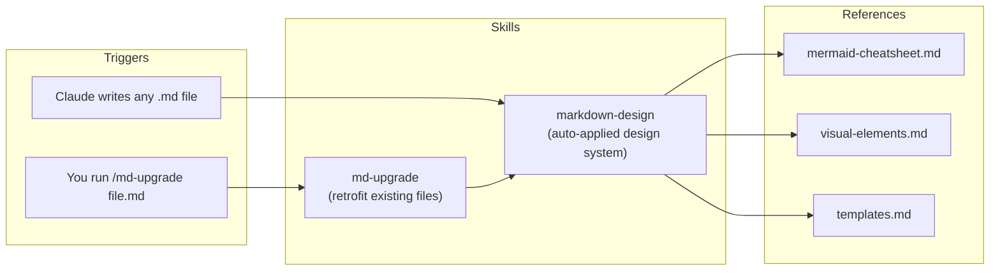

# Markdown Designer

**Two Claude Code skills that stop Claude from generating plain-text markdown — every `.md` it writes gets diagrams, tables, alerts, and structure by default.**

## How the skills work



| Skill | Trigger | What it does |
|---|---|---|
| `markdown-design` | Automatic, whenever Claude creates/rewrites a `.md` file | Applies a design system: Mermaid diagrams, comparison tables, GitHub alerts, collapsible sections, status markers, doc templates |
| `md-upgrade` | `/md-upgrade <path>` (or "upgrade this markdown") | Redesigns an **existing** plain file visually — zero information loss, zero invented data |

## Install

Via the [skills.sh](https://skills.sh) ecosystem (works for Claude Code and other agents):

```bash
npx skills add Sourabh10122002/markdown-designer
```

Or via this repo's own installer:

```bash
npx markdown-designer-skills
```

Both put the skills where Claude Code discovers them, making them active in your sessions (new sessions pick them up on start).

| Command | Effect |
|---|---|
| `npx skills add Sourabh10122002/markdown-designer` | Install via the skills.sh CLI |
| `npx markdown-designer-skills` | Install globally (`~/.claude/skills/`) |
| `npx markdown-designer-skills --project` | Install only for the current project (`./.claude/skills/`) |
| `npx markdown-designer-skills --uninstall` | Remove the skills |

> [!IMPORTANT]
> The `npx markdown-designer-skills` form works once the package is published to npm (`npm publish`). The `npx skills add` form only needs this GitHub repo to be public.

> [!NOTE]
> This repo is the editable source. After changing anything under [skills/](skills/), re-run the install command to sync.

## Layout

```text
bin/
└── install.js                        # npx installer (--project, --uninstall, --help)
skills/
├── markdown-design/
│   ├── SKILL.md                      # design system + structure→element mapping
│   └── references/
│       ├── mermaid-cheatsheet.md     # 11 diagram types, verified syntax, failure fixes
│       ├── visual-elements.md        # alerts, tables, collapsible, badges, progress bars
│       └── templates.md              # README / architecture / status / ADR / runbook skeletons
└── md-upgrade/
    └── SKILL.md                      # retrofit workflow with hard no-loss rules
```

## Try it

After installing, open a **new** Claude Code session and ask:

- *"Write an architecture doc for a URL shortener"* → should come back with flowchart + sequence diagram + ER diagram + decision table.
- */md-upgrade README.md* on any old plain file → redesigned in place.
