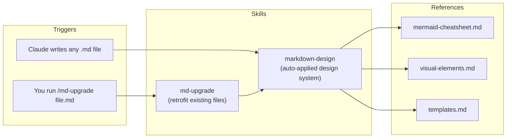

# Markdown Designer

**Two agent skills that stop your AI from generating plain-text markdown — every `.md` it writes gets diagrams, tables, alerts, and structure by default.**

[](https://skills.sh/Sourabh10122002/markdown-designer)


```bash
npx skills add Sourabh10122002/markdown-designer
```

## How the skills work



| Skill | Trigger | What it does |
|---|---|---|
| `markdown-design` | Automatic, whenever Claude creates/rewrites a `.md` file | Applies a design system: Mermaid diagrams, comparison tables, GitHub alerts, collapsible sections, status markers, doc templates |
| `md-upgrade` | `/md-upgrade <path>` (or "upgrade this markdown") | Redesigns an **existing** plain file visually — zero information loss, zero invented data |

## Install

```bash
npx skills add Sourabh10122002/markdown-designer
```

The [skills.sh](https://skills.sh/Sourabh10122002/markdown-designer) CLI installs into the universal `~/.agents/skills/` directory and symlinks the skills wherever your agents look — Claude Code, Cursor, Codex, Gemini CLI, GitHub Copilot, Windsurf, and 12+ more. New agent sessions pick them up automatically.

<details>
<summary><b>Alternative: install as a Claude Code plugin</b></summary>

This repo doubles as a [plugin marketplace](https://code.claude.com/docs/en/plugin-marketplaces). In Claude Code:

```text
/plugin marketplace add Sourabh10122002/markdown-designer
/plugin install markdown-designer@markdown-designer
```

Plugin skills are namespaced, e.g. `/markdown-designer:md-upgrade`.

</details>

<details>
<summary><b>Alternative: install from a local checkout</b></summary>

```bash
git clone https://github.com/Sourabh10122002/markdown-designer.git
cd markdown-designer
node bin/install.js            # → ~/.claude/skills/  (or: ./install.sh)
node bin/install.js --project  # → ./.claude/skills/ of the current project
node bin/install.js --uninstall
```

</details>

> [!NOTE]
> This repo is the editable source. After changing anything under [skills/](skills/), re-run the install command to sync.

## Layout

```text
bin/
└── install.js                        # npx installer (--project, --uninstall, --help)
skills/
├── markdown-design/
│   ├── SKILL.md                      # design system + structure→element mapping
│   └── references/
│       ├── mermaid-cheatsheet.md     # 11 diagram types, verified syntax, failure fixes
│       ├── visual-elements.md        # alerts, tables, collapsible, badges, progress bars
│       └── templates.md              # README / architecture / status / ADR / runbook skeletons
└── md-upgrade/
    └── SKILL.md                      # retrofit workflow with hard no-loss rules
```

## Try it

After installing, open a **new** Claude Code session and ask:

- *"Write an architecture doc for a URL shortener"* → should come back with flowchart + sequence diagram + ER diagram + decision table.
- */md-upgrade README.md* on any old plain file → redesigned in place.
