# Mermaid Cheatsheet

Copy-adapt these verified patterns. All render natively on GitHub, GitLab, and VS Code (with mermaid preview support). Every block goes inside a fenced code block tagged `mermaid`.

## 1. Flowchart — processes, pipelines, decision logic

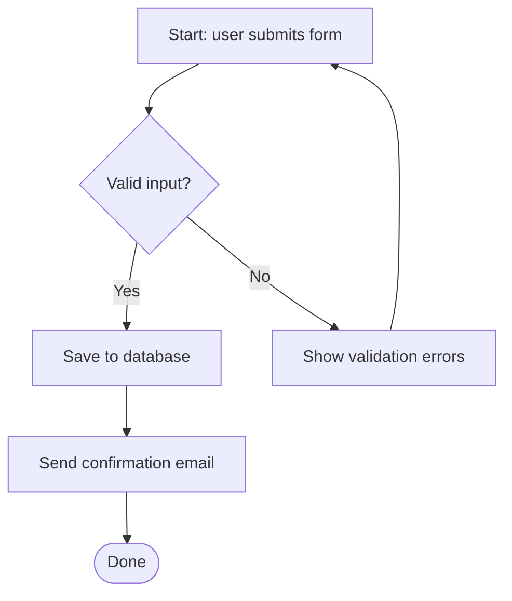

Directions: `TD` (top-down), `LR` (left-right, best for pipelines), `BT`, `RL`.

Node shapes:
| Syntax | Shape | Use for |
|---|---|---|
| `A[text]` | Rectangle | Process step |
| `A{text}` | Diamond | Decision |
| `A([text])` | Stadium | Start / end |
| `A[(text)]` | Cylinder | Database |
| `A((text))` | Circle | Connector point |
| `A[/text/]` | Parallelogram | Input / output |
| `A[[text]]` | Subroutine | Sub-process |

Edges: `-->` arrow, `---` line, `-.->` dotted, `==>` thick, `-- label -->` labeled.

### Architecture variant with subgraphs

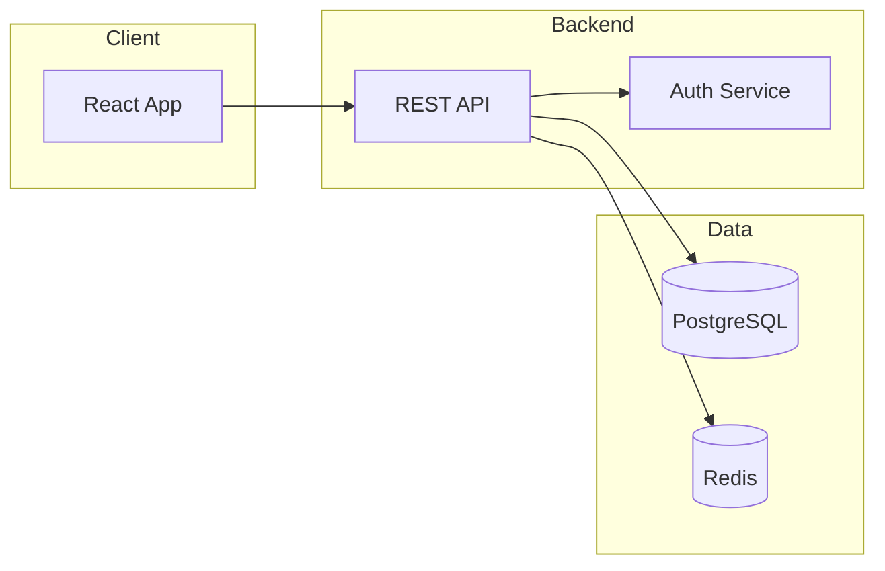

## 2. Sequence diagram — interactions over time

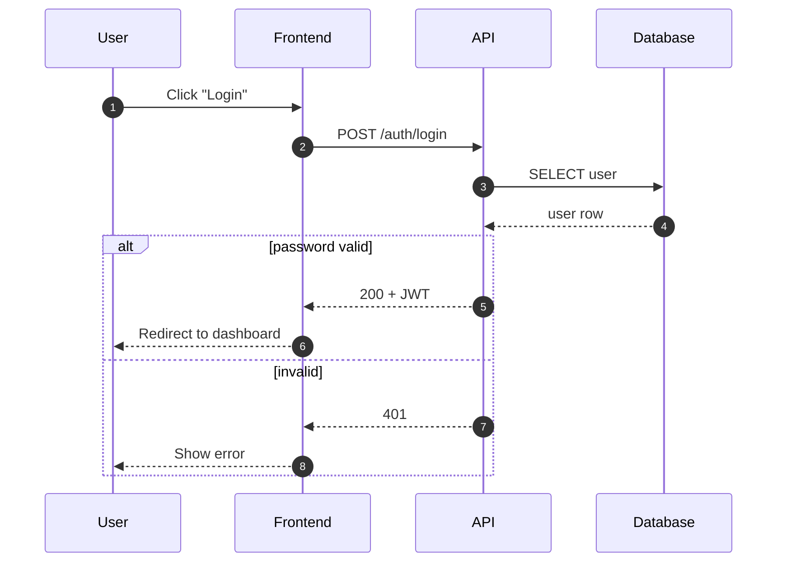

Arrows: `->>` solid (request), `-->>` dashed (response), `-x` lost message. Blocks: `alt/else/end`, `loop/end`, `opt/end`, `par/and/end`. `autonumber` numbers each step.

## 3. State diagram — lifecycles and transitions

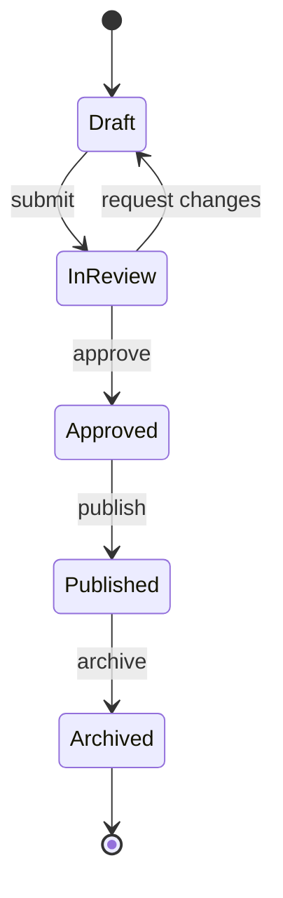

`[*]` is both initial and final state. Nested states: `state Parent { A --> B }`.

## 4. Gantt — schedules and phases

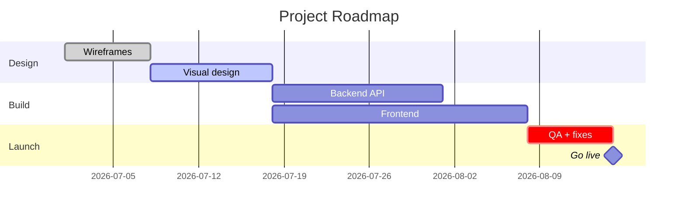

Tags: `done`, `active`, `crit`, `milestone`. Durations: `7d`, `2w`. Dependencies: `after <id>`.

## 5. Timeline — chronological events / roadmap

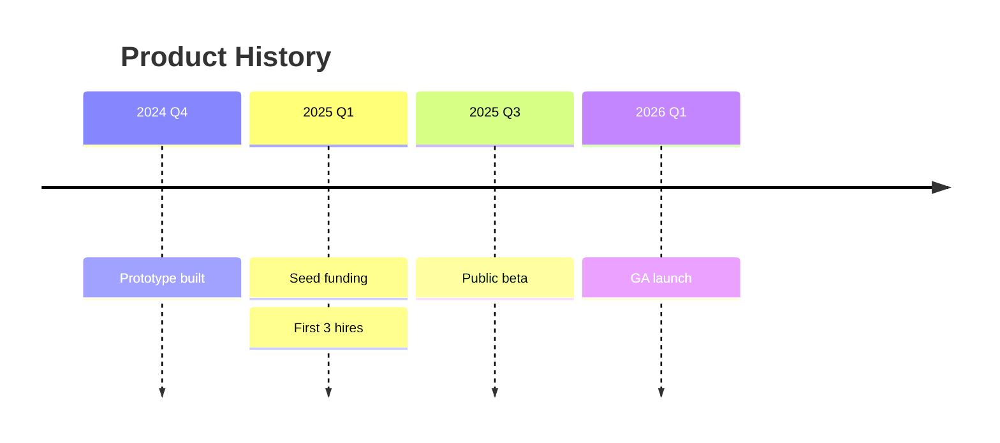

## 6. ER diagram — database schemas

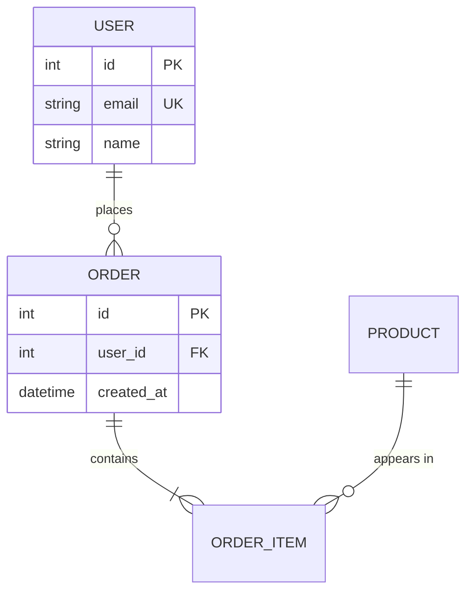

Cardinality: `||` exactly one, `o|` zero or one, `o{` zero or more, `|{` one or more.

## 7. Pie — proportions (only with real numbers)

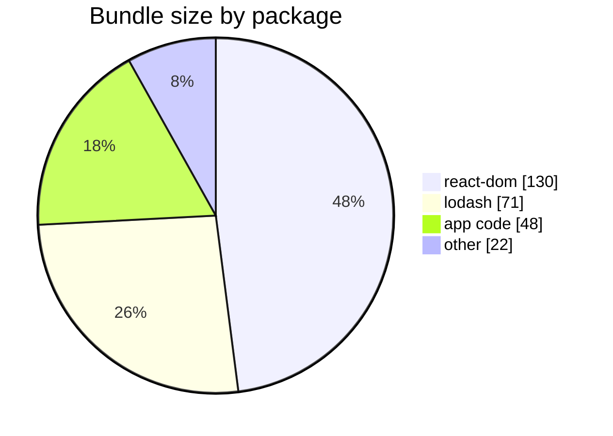

## 8. Class diagram — type relationships

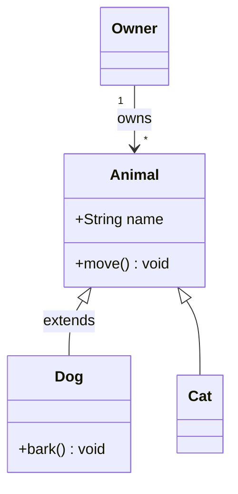

Relations: `<|--` inheritance, `*--` composition, `o--` aggregation, `-->` association, `..>` dependency.

## 9. Git graph — branching strategies

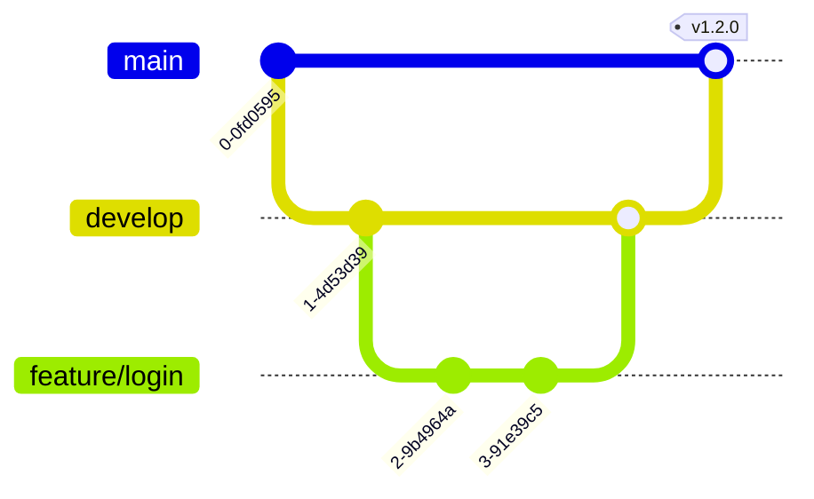

## 10. Mindmap — hierarchies and brainstorms

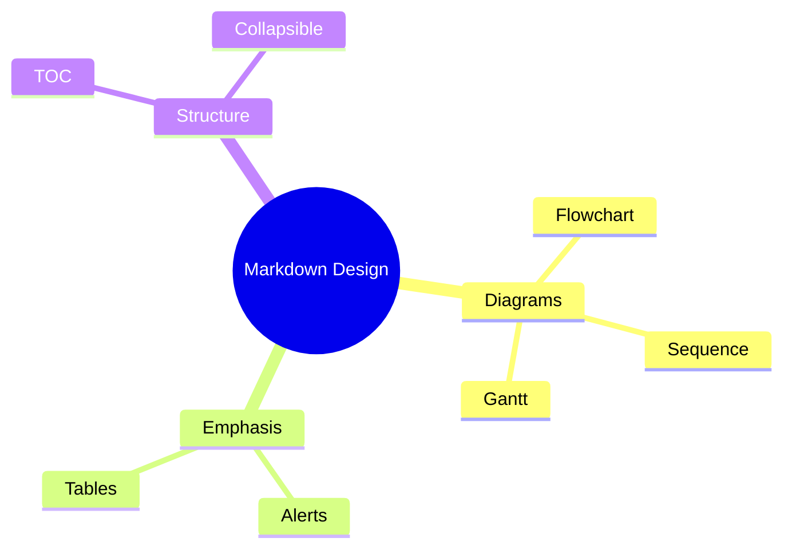

Indentation defines hierarchy. Shapes: `((circle))`, `(rounded)`, `[square]`.

## 11. Quadrant chart — prioritization

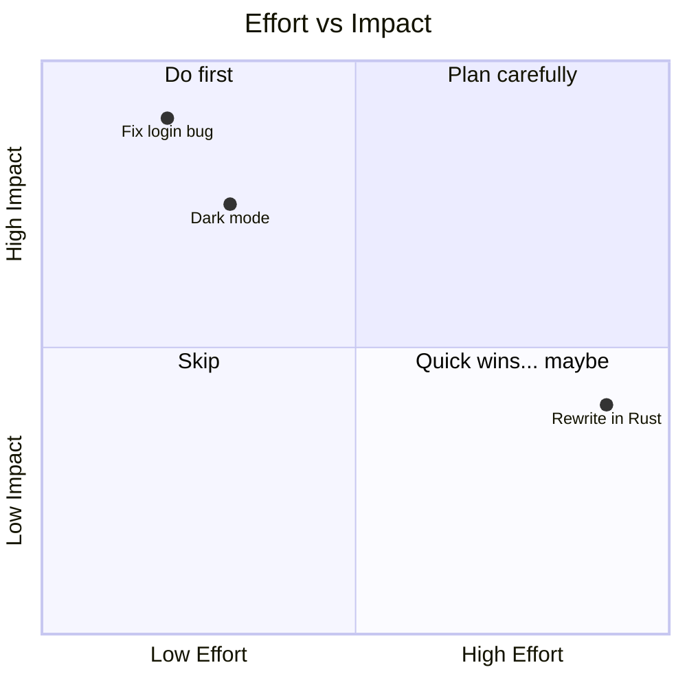

Coordinates are `[x, y]` in 0–1 range.

## Common render failures and fixes

| Symptom | Cause | Fix |
|---|---|---|
| Diagram breaks mid-render | Unquoted `( ) : ; #` in a label | Quote the label: `A["Step (2)"]` |
| Flowchart ends abruptly | Node ID literally named `end` | Rename to `End`/`finish` |
| Label line break ignored | `\n` used | Use `<br/>` |
| Nothing renders | Fence tagged wrong | Must be exactly ```` ```mermaid ```` |
| Gantt bars missing | Date format mismatch | Match `dateFormat` to your dates |
| Arrows crossing chaos | Too many nodes | Split into 2+ diagrams, ≤20 nodes each |
| Subgraph name breaks | Spaces/punctuation in ID | `subgraph id["Display Name"]` |
